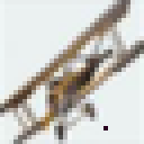
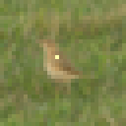
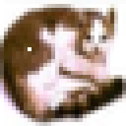
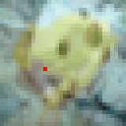
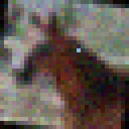

# adversial-attacks
Create adversarial examples that fool neural networks.


## One Pixel Attack

### Model
Dataset - **CIFAR-10**  
Accuracy - **85%**

```
----------------------------------------------------------------

"""
input   - (3, 32, 32)
block 1 - (32, 32, 32)
maxpool - (32, 16, 16)
block 2 - (64, 16, 16)
maxpool - (64, 8, 8)
block 3 - (128, 8, 8)
maxpool - (128, 4, 4)
block 4 - (128, 4, 4)
avgpool - (128, 1, 1), reshpe to (128,)
fc      - (128,) -> (10,)
"""

# block
Conv2d(in_channels, out_channels, kernel_size=3, padding=1)
ReLU()
Conv2d(32, 32, kernel_size=3, padding=1)
BatchNorm2d(32)
ReLU()

#
MaxPool2d(kernel_size=2, stride=2)

# avgpool
AdaptiveAvgPool2d(1)

# fc
Linear(256, 10)

----------------------------------------------------------------
```


### Results  

Attacks are typically successful for images with low confidence. For successful attacks on high confidence images increase `d`, i.e., number of pixels to perturb.

|  |  |   |          |    |
|:------------------------------------------:|:----------------------------------:|:---------------------------------:|:-----------------------------------------:|:--------------------------------------:|  
| **bird [0.8075]**                   |               **deer [0.8933]**           |  **frog [0.8000]**                |                        **bird [0.6866]**   |       **deer [0.9406]**                |


